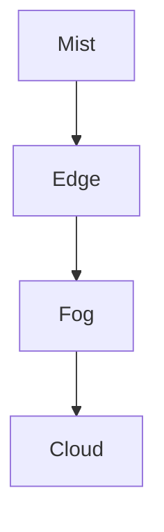

# Tarea (c+d+e) · Edge, Fog, Mist y Cloud (DAW 1º)

## 🅲 Tarea C — Edge Computing y relación con Cloud
**Definición (3–5 líneas):**
Edge Computing es un paradigma de computación distribuida donde el procesamiento de datos ocurre en dispositivos cercanos al lugar de generación, como routers, gateways o dispositivos IoT. Esto reduce la latencia y mejora la eficiencia de la red al realizar tareas de procesamiento sin depender completamente de la nube.

**Relación Edge ↔ Cloud (5–8 líneas):**
La relación entre Edge Computing y Cloud Computing es complementaria. Mientras que la nube ofrece capacidades de procesamiento y almacenamiento a gran escala, Edge Computing permite realizar procesamiento local en dispositivos cercanos al usuario o máquina, lo que reduce la latencia y el uso de ancho de banda. La nube se encarga de las tareas más intensivas en recursos, mientras que el edge maneja los procesos que requieren una respuesta rápida y en tiempo real.

**Ejemplo real:**
Un ejemplo real de Edge Computing es el uso de cámaras de seguridad inteligentes que procesan imágenes localmente para detectar movimientos o personas, enviando solo los datos relevantes a la nube para almacenamiento o análisis posterior.

**Fuentes oficiales (mín. 2):**
- [IBM Edge Computing](https://www.ibm.com/cloud/edge-computing)
- [Microsoft Azure Edge Computing](https://azure.microsoft.com/en-us/overview/edge-computing/)

## 🅳 Tarea D — Fog vs Mist (niveles y zonas de aplicación)

**Definición Fog (2–4 líneas):**
Fog Computing es un modelo que extiende la computación en la nube hacia los dispositivos cercanos al usuario, pero a diferencia del Edge, abarca una capa adicional de procesamiento, almacenamiento y redes entre los dispositivos finales y la nube. Se utiliza para casos donde el procesamiento no puede hacerse completamente en el borde, pero debe realizarse cerca del lugar de origen.

**Definición Mist (2–4 líneas):**
Mist Computing es una forma más ligera de Fog Computing, orientada a dispositivos con recursos limitados. El procesamiento ocurre aún más cerca de los sensores o dispositivos IoT, siendo un paso previo antes de enviar datos a la red más amplia.

**Esquema (ASCII o Mermaid recomendado):**

**Zonas de aplicación (qué hace cada capa):**
- Mist → Realiza tareas de procesamiento en dispositivos de bajo consumo como sensores o pequeños dispositivos IoT. Es responsable de recoger y filtrar datos antes de enviarlos a las capas superiores.
- Edge → Procesa datos localmente en dispositivos cercanos al usuario, lo que permite respuestas rápidas a eventos o situaciones. Enviar solo datos relevantes a Fog o Cloud para análisis más complejos.
- Fog → Actúa como un puente entre el Edge y la nube, proporcionando procesamiento adicional y almacenamiento temporal. En esta capa, se manejan tareas que no pueden realizarse en tiempo real en el Edge pero tampoco requieren la infraestructura completa de la nube.
- Cloud → Ofrece capacidades de procesamiento masivo, almacenamiento de grandes volúmenes de datos y análisis de datos complejos. Es donde se realizan las operaciones que requieren gran potencia y capacidad de almacenamiento.

## 🅴 Tarea E — Ventajas de la Cloud en sistemas conectados
Incluye mínimo 3 ventajas (recomendado 5), con explicación + ejemplo.

1) Ventaja: Escalabidad

   Explicación: La nube permite a las empresas aumentar o reducir sus recursos de manera flexible y bajo demanda. Esto significa que no es necesario realizar grandes inversiones en infraestructura física, ya que los servicios en la nube pueden ajustarse a las necesidades específicas de cada momento.

   Ejemplo: Una tienda en línea que experimenta un aumento en el tráfico durante eventos de ventas especiales, como el Black Friday, puede incrementar rápidamente su capacidad de servidores en la nube para manejar el mayor número de visitas sin tener que invertir en servidores adicionales de forma permanente.

3) Ventaja: Accesibilidad remota

   Explicación: Los servicios en la nube se pueden acceder desde cualquier lugar y dispositivo con conexión a Internet, lo que permite a los usuarios trabajar de manera remota y colaborar en tiempo real. Esto resulta especialmente beneficioso para equipos distribuidos geográficamente o trabajadores a distancia.

   Ejemplo: Un equipo de desarrollo de software que trabaja en diferentes países puede acceder a la misma base de datos y herramientas de desarrollo en la nube, manteniendo una sincronización constante sin necesidad de instalar aplicaciones localmente en cada dispositivo.

4) Ventaja: Seguridad mejorada
   
   Explicación: Los proveedores de servicios en la nube suelen ofrecer altos estándares de seguridad, con protección contra desastres, copias de seguridad automáticas y sistemas avanzados de encriptación. Además, las actualizaciones y parches de seguridad se gestionan de forma centralizada.

   Ejemplo: Una empresa que maneja datos sensibles de clientes, como información financiera, puede confiar en que sus datos estarán protegidos mediante técnicas de encriptación avanzadas y respaldos automáticos en la nube, lo que reduce el riesgo de pérdida o fuga de datos.

**Fuente oficial (mín. 1):**
- - [The NIST Definition of Cloud Computing, National Institute of Standards and Technology, 2011](https://nvlpubs.nist.gov/nistpubs/Legacy/SP/nistspecialpublication800-145.pdf)

## 📚 Fuentes (enlaces oficiales)
(Recopila aquí todos los enlaces oficiales usados)

Adrián Domínguez Obrero
